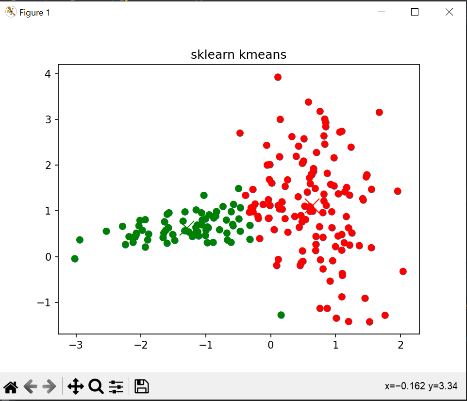
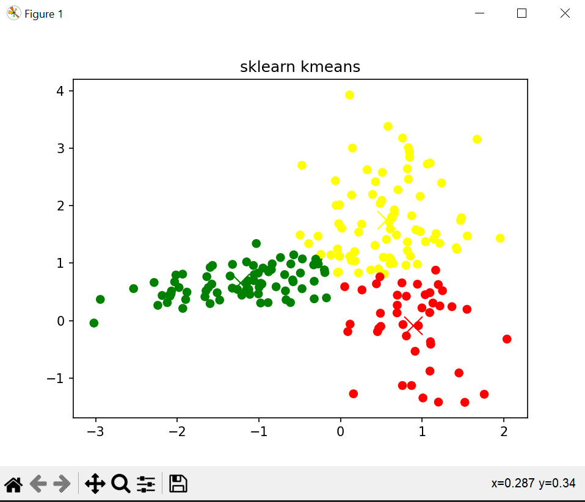
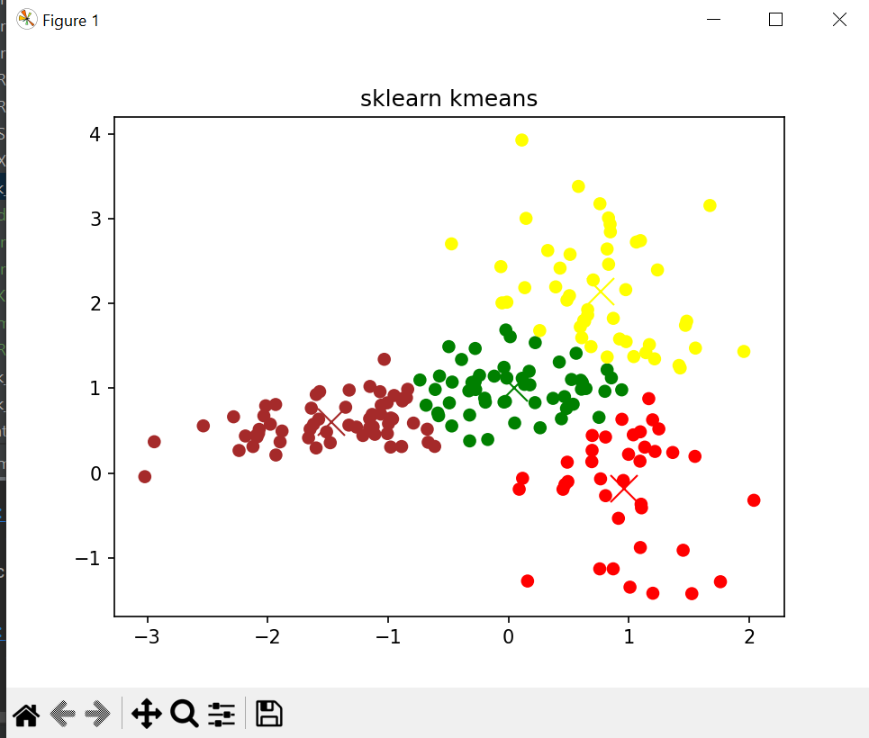
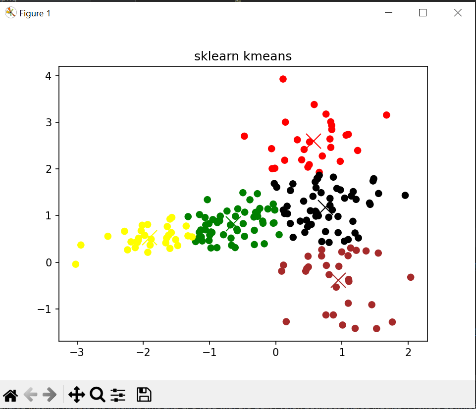
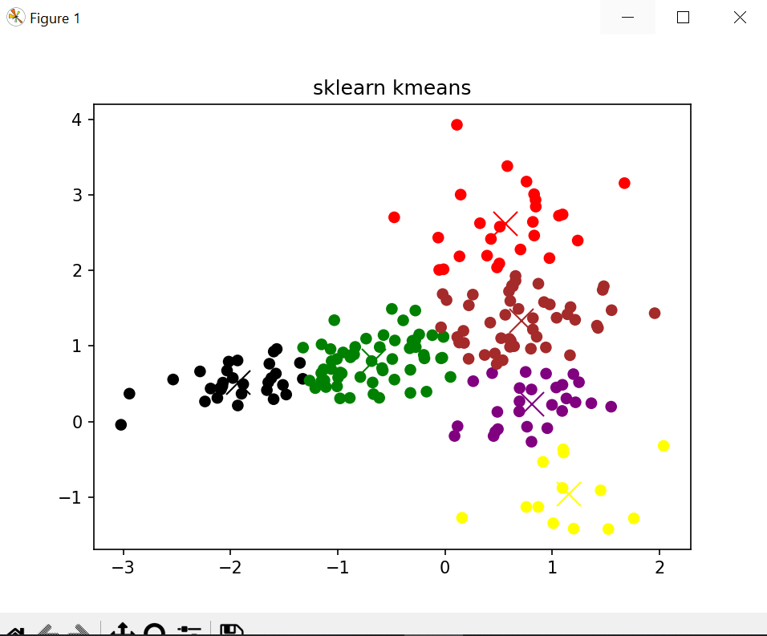
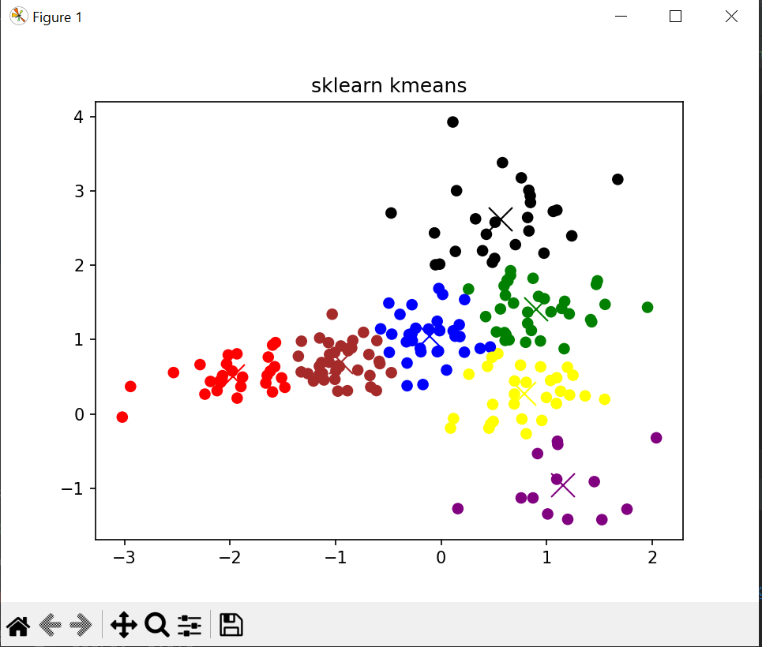
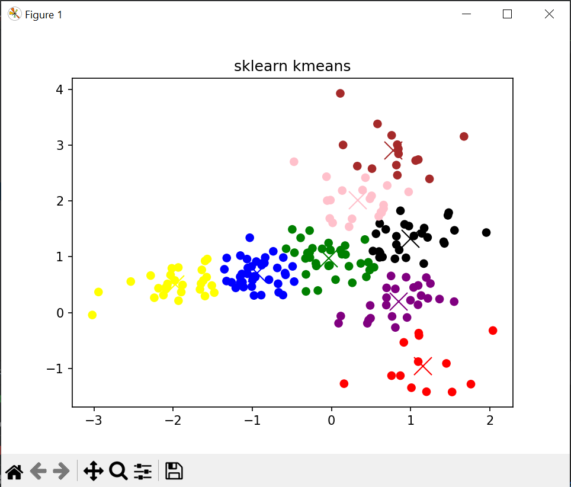
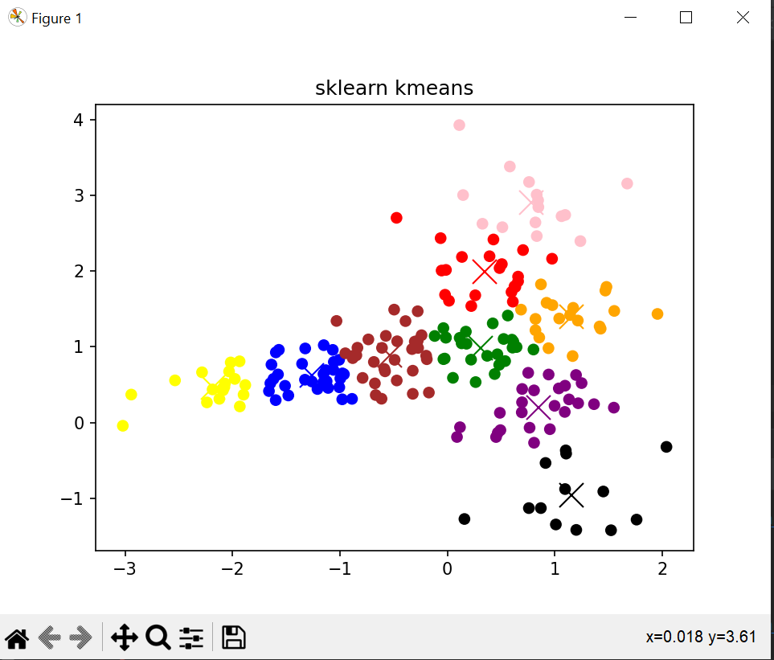
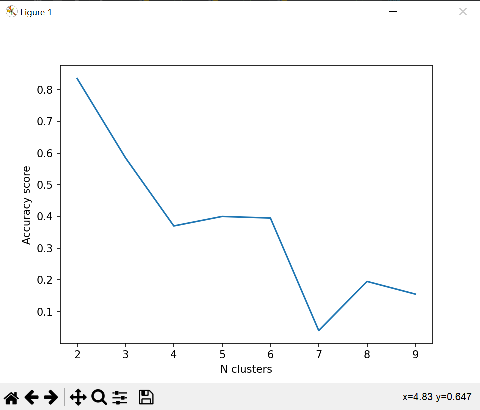

# K-Means Sklearn
N Clusters:  2
Score:  0.835

N Clusters:  3
Score:  0.585

N Clusters:  4
Score:  0.37

N Clusters:  5
Score:  0.4

N Clusters:  6
Score:  0.395

N Clusters:  7
Score:  0.04

N Clusters:  8
Score:  0.195

N Clusters:  9
Score:  0.155

# Accuracy score x number of clusters

