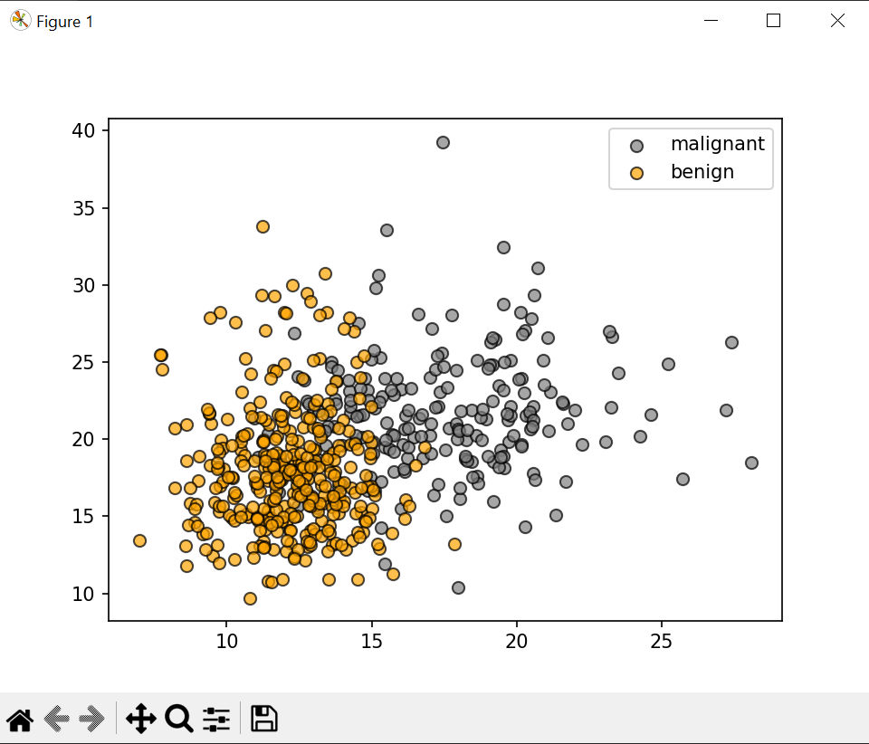
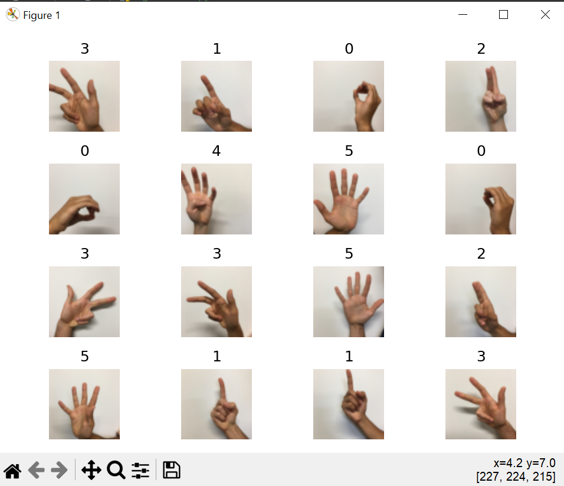
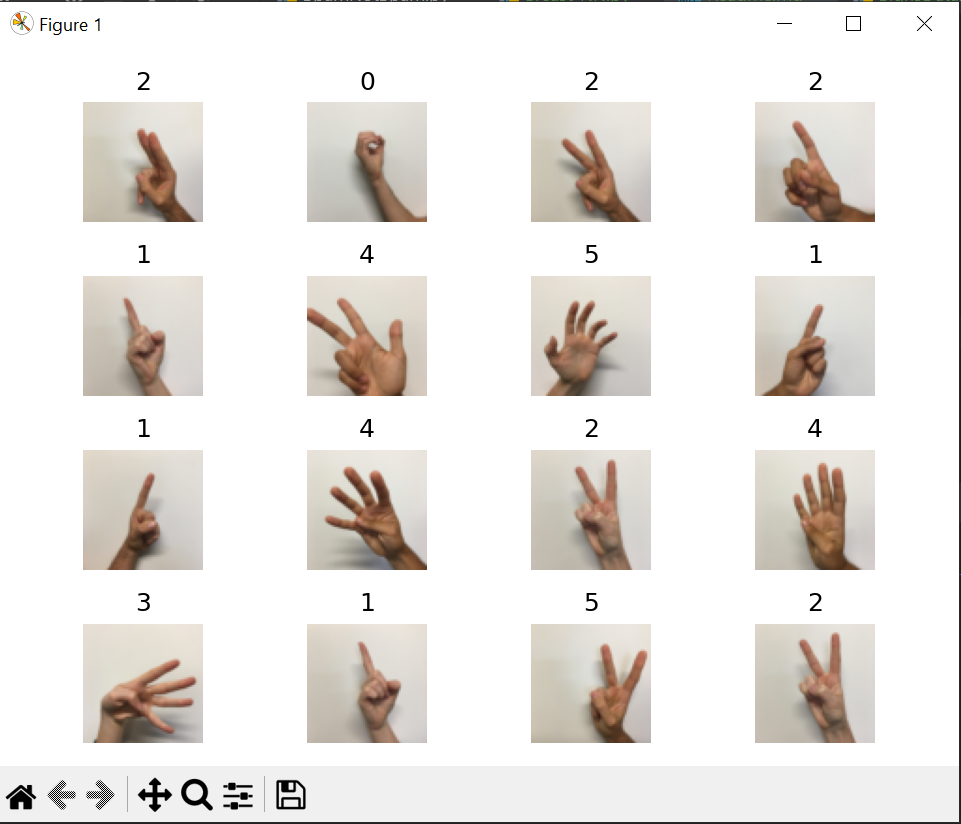

# Breast Cancer NN

train accuracy= 93.192%

test accuracy= 93.192%

After change hidden layer sizes and alpha (scaled data):

train accuracy= 99.296%

test accuracy= 99.296%

# signs dataset
X_train.shape= (1080, 64, 64, 3)

X_test.shape= (120, 64, 64, 3)

y_train.shape= (1080,)

y_test.shape= (120,)

number of training examples = 12288

number of test examples = 12288

X_train_scaled shape: (1080, 12288)

X_test_scaled shape: (120, 12288)

train accuracy= 99.722%

test accuracy= 77.500%
# Train

# Test
