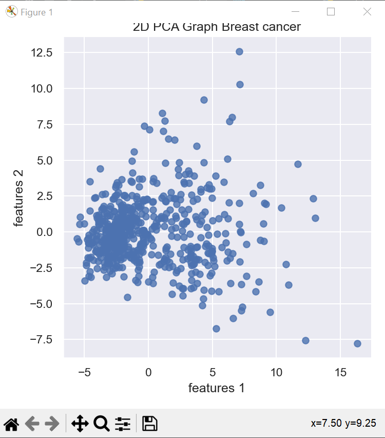
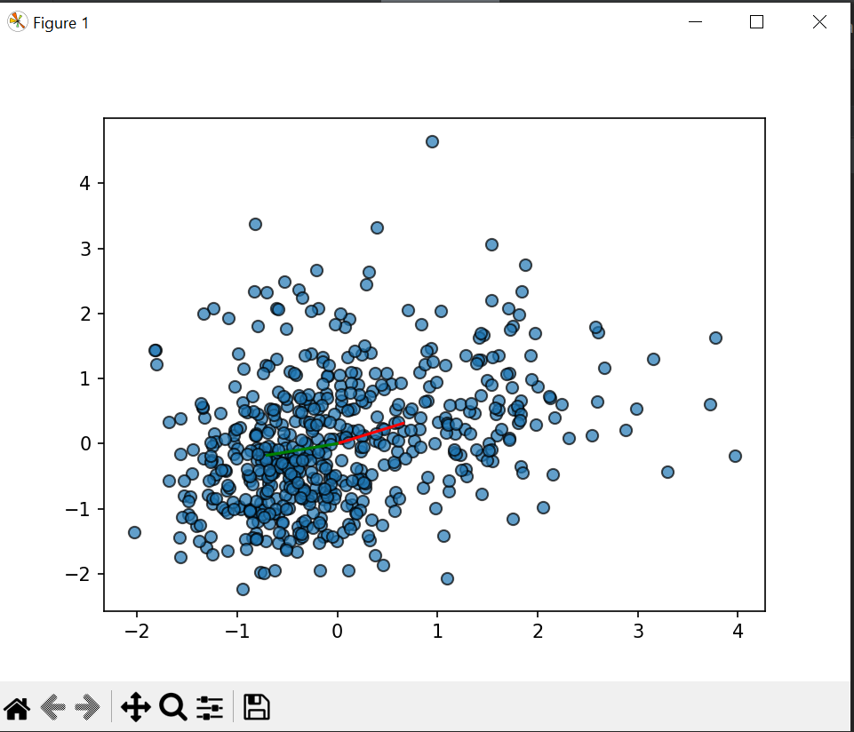
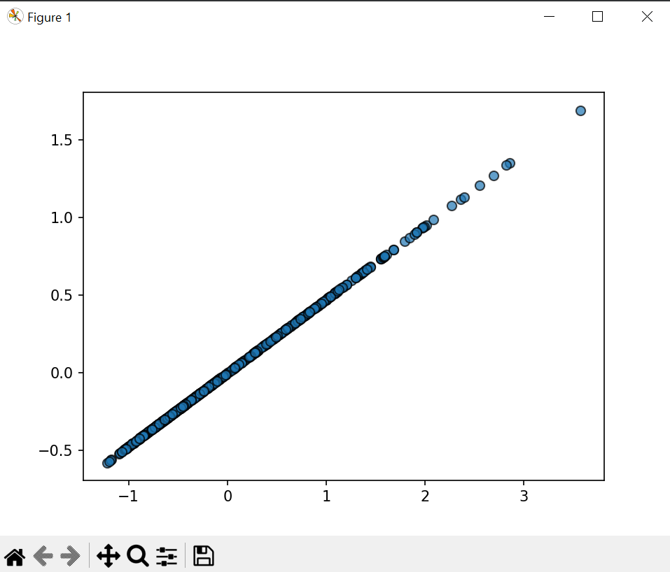

# PCA Sklearn 

#PCA 

Dataset:

Draw vectors:

Shape: (569, 1):

Коваріаційна матриця:

     [ 7.06588569e-03  1.19205351e-01  5.10185297e-02  3.73759735e-03
       4.99316369e-01  6.87382323e-01  5.14929891e-01  3.68661134e-01
       4.38413498e-01  7.67296779e-01  4.95594325e-02 -4.56545686e-02
       8.54325721e-02  1.75392951e-02  1.01480315e-01  5.90972763e-01
       4.39329269e-01  3.10654551e-01  7.80794763e-02  5.91328066e-01
       9.34919787e-02  2.19122425e-01  1.38956862e-01  7.96470340e-02
       6.17624192e-01  8.10454856e-01  6.86510921e-01  5.11114146e-01
       5.37848206e-01  1.00000000e+00]]

Compress score= 0.557