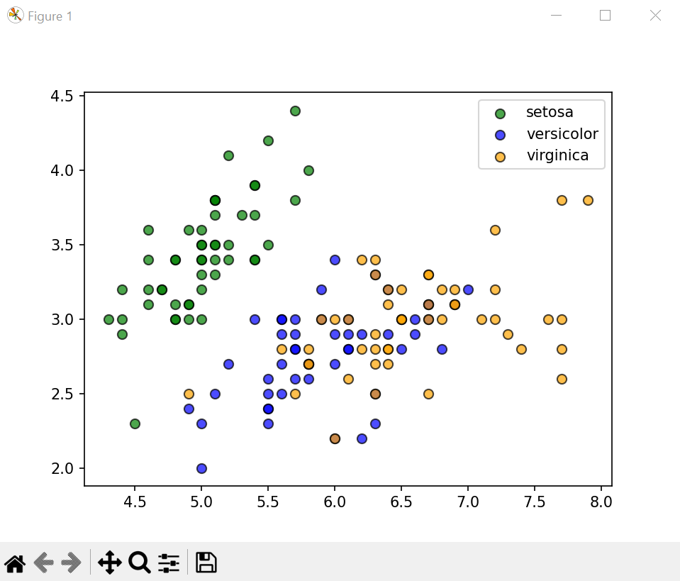
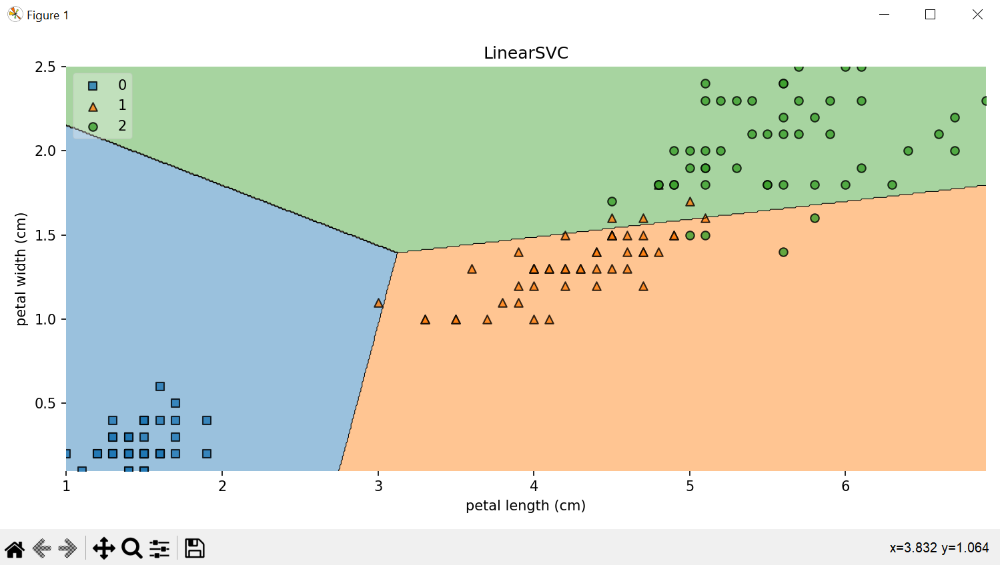
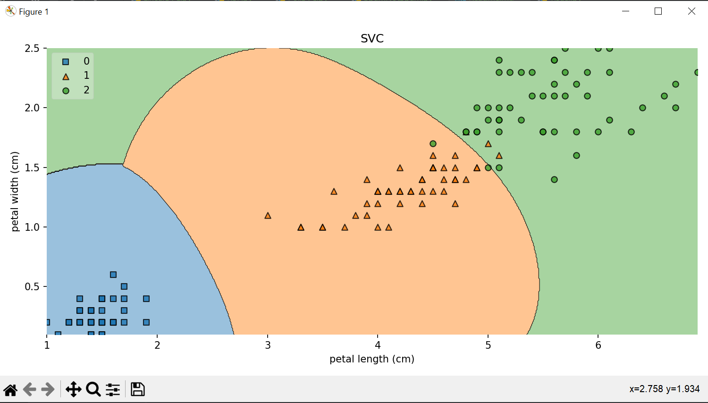
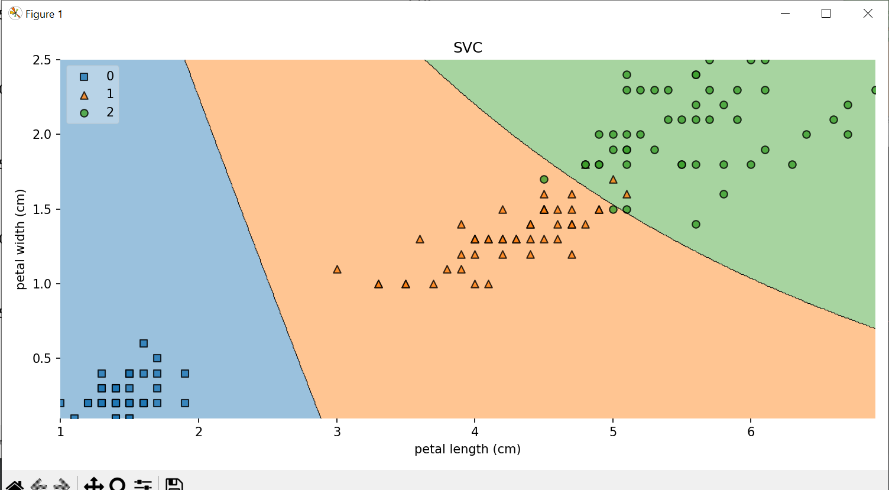

# Linear SVC
train accuracy= 96.667%

    b = [ 0.10956151  1.67985254 -1.70978143]

    w = [[ 0.18424363  0.45122558 -0.80794612 -0.45071242]
     [ 0.05616711 -0.8992125   0.40884202 -0.96178684]
     [-0.85070832 -0.98675265  1.38096866  1.86550671]]

# Boundary

# RBF
train accuracy= 98.000%

For 2 Features:

train accuracy= 96.667%
# Boundary

# PolinomialSVC
train accuracy= 97.333%

For 2 featureas:

train accuracy= 96.667%
# Boundary

 